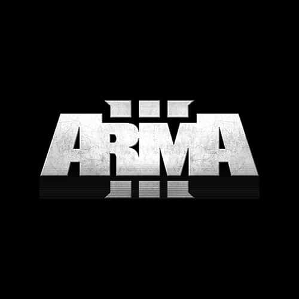

<p align="center">
  
</p>

<h1 align="center">WindowsGSM.ARMA3</h1>

<p align="center">
  MeFriendos build for running an Arma 3 Dedicated Server with WindowsGSM.
</p>

<p align="center">
  <a href="https://github.com/Raziel7893/WindowsGSM/releases/tag/v1.25.1.22"></a>
  <a href="CHANGELOG.md"></a>
  <a href="https://github.com/PapaGordon/WindowsGSM.ARMA3-MeFriendos/releases/latest"></a>
  <a href="LICENSE"></a>
</p>

This plugin installs, updates and runs the Arma 3 Dedicated Server through SteamCMD. The MeFriendos build keeps the familiar WindowsGSM workflow while adding 64-bit server startup, a safer firewall policy, a read-only RPT-backed embedded console and repaired native **Toggle Console** handling.

## Features

- Installs and updates the official Arma 3 Dedicated Server through SteamCMD.
- Starts `arma3server_x64.exe`.
- Mirrors the active Arma 3 `.rpt` log into the WindowsGSM embedded console.
- Keeps Embedded Console and native Toggle Console as separate features.
- Refreshes and discovers the native Arma window through multiple Win32 fallback paths.
- Monitors the resolved native window for the lifetime of the running Arma process.
- Synchronizes the resolved HWND with WindowsGSM's `ServerMetadata.MainWindow` and `windowsIntPtr` cache.
- Integrates with Raziel WindowsGSM's persistent `ShowConsole` state so Toggle Console can directly show and hide the correct window.
- Uses reflection for `ShowConsole`, retaining a compatibility path for WindowsGSM builds without that field.
- Writes Toggle Console diagnostics to `arma3-toggle-console.log` in the server cache folder.
- Tries a normal console-window close before falling back to process termination.
- Removes WindowsGSM's automatic application-wide firewall exception before the server starts listening.
- Leaves targeted manual firewall rules unchanged.
- Uses a `100`-port WindowsGSM instance increment for safer multi-instance layouts.
- Supports custom startup parameters for mods, server mods, profiles and custom configs.

## Quick overview

| Setting | Value |
| --- | --- |
| Development version | `0.1.2` (unreleased) |
| Latest published plugin release | `0.1.1` |
| Runtime validation | **Approved** |
| Tested WindowsGSM build | `Raziel7893/WindowsGSM v1.25.1.22` |
| SteamCMD App ID | `233780` |
| Start executable | `arma3server_x64.exe` |
| Default game port | `2302/UDP` |
| Default query port | `2303/UDP` |
| Default WindowsGSM port increment | `100` |
| Installation login | Steam account |
| Default parameters | `-profiles=ArmaHosts -config=server.cfg` |
| Firewall ports | Manual configuration only |
| Embedded console | Read-only RPT mirror |
| Toggle Console | Native Arma / classic console-host window |

## Requirements

- Primary MeFriendos environment: **Raziel7893/WindowsGSM v1.25.1.22**
- Windows x64
- Administrator rights for WindowsGSM when the firewall safety check is enabled
- A Steam account usable by SteamCMD for installation and updates
- For Raziel WindowsGSM v1.25.1.22: the **.NET 8 Desktop Runtime** required by that WindowsGSM build

The Arma 3 Dedicated Server package uses Steam App ID `233780`.

## Plugin installation

### Stable plugin release

1. Download the latest published plugin release.
2. Extract the complete `ARMA3.cs` folder into `<WindowsGSM>\plugins\`.
3. Click **Reload Plugins** or restart WindowsGSM.
4. Add **Arma 3 Dedicated Server** in WindowsGSM.
5. Enter the Steam credentials requested by WindowsGSM and click **Install**.
6. Configure `server.cfg`, your profile and any `-mod` / `-serverMod` parameters.
7. Create only the required manual firewall rules.
8. Start the server.

### Current 0.1.2 build from main

Until `0.1.2` is published as a GitHub release, use **Code → Download ZIP** on the repository's `main` branch. Copy the included `ARMA3.cs` folder into the WindowsGSM plugins folder, reload the plugin or restart WindowsGSM, and fully restart the Arma server so the new native-window monitor attaches to the new process.

## Updating Arma 3

1. Stop the server.
2. Back up `server.cfg`, profiles, missions and locally managed server files.
3. Click **Update** in WindowsGSM.
4. Start the server and review the RPT / embedded-console output.

SteamCMD updates the dedicated-server files. The plugin does not intentionally rewrite your mission, Altis Life configuration, mod list, `server.cfg` or profile files.

## Console behavior

WindowsGSM exposes two different console-related features for this plugin:

- **Embed Console** shows read-only Arma server output inside WindowsGSM by following the active `.rpt` file.
- **Toggle Console** shows or hides the native Arma/classic console-host window selected through WindowsGSM's stored HWND.

### Embedded console

Arma 3 Dedicated Server on Windows does not provide dependable server output through redirected `stdout` / `stderr`. Since version `0.1.1`, the plugin therefore leaves the Arma process unredirected and follows the active `.rpt` log instead.

When **Embed Console** is enabled, the plugin:

- resolves relative, absolute and quoted `-profiles=` paths;
- falls back to `%LOCALAPPDATA%\Arma 3` when no `-profiles=` parameter is configured;
- watches the profile root and direct profile subfolders for the active Arma RPT file;
- mirrors newly written RPT lines into the WindowsGSM console;
- avoids deliberately attaching to an unchanged RPT left behind by a previous run;
- stops following the file when the associated Arma process exits;
- reports a clear message if `-noLogs` disables the RPT source.

This console is intentionally **read-only**. Use supported in-game `#` admin commands or BattlEye RCon for administration.

The `0.1.1` RPT-based console path was runtime-tested with WindowsGSM `v1.25.1.21` before that release.

### Native Toggle Console — 0.1.2

The first unreleased `0.1.2` attempt used a short startup-only `AttachConsole()` synchronization. Runtime testing showed that this was not sufficient.

Reviewing the actual MeFriendos WindowsGSM build, **Raziel7893 v1.25.1.22**, exposed an important difference from upstream WindowsGSM: Raziel's Toggle Console implementation persists a `ShowConsole` state and the old `RedirectStandardOutput` guard is commented out. The button toggles `ShowConsole`, stores that setting and applies `ShowNormal` or `Hide` to the cached HWND.

The current `0.1.2` implementation therefore:

1. Calls `Process.Refresh()` before reading `Process.MainWindowHandle`.
2. Rejects an unsuitable cached helper-window handle.
3. Enumerates top-level windows owned by the Arma PID when necessary.
4. Prefers `ConsoleWindowClass`; otherwise only a visible process-owned fallback window is accepted.
5. Uses `AttachConsole()` / `GetConsoleWindow()` as an additional console-specific fallback.
6. Rejects `PseudoConsoleWindow` as an unsafe native Toggle Console target.
7. Writes a valid target into the matching WindowsGSM `ServerMetadata.MainWindow` and `windowsIntPtr` cache.
8. Continues monitoring while the Arma process is alive so a stale or replaced HWND can be repaired later.
9. Detects Raziel's `ShowConsole` state through reflection.
10. Directly applies `ShowNormal` or `Hide` to the correctly resolved HWND when Toggle Console changes that state.

**Runtime validation succeeded on 2026-09-10 with Raziel7893/WindowsGSM v1.25.1.22:** Toggle Console successfully shows the native Arma console and hides it again. The implementation is therefore runtime-approved for the MeFriendos environment.

### Toggle Console diagnostics

The monitor creates:

```text
<WindowsGSM>\servers\<server-id>\cache\arma3-toggle-console.log
```

The log records the Arma PID, WindowsGSM version, window-discovery path, HWND changes, `ShowConsole` synchronization and `AttachConsole` errors. It can be used for troubleshooting on other WindowsGSM or Windows builds even though the MeFriendos v1.25.1.22 runtime test passed.

## Profiles and server name

For compatibility with the original plugin, the WindowsGSM **Server Name** is passed as Arma's `-name` parameter. In Arma, `-name` selects the **profile name**; it is not the public browser hostname.

Set the public server name in `server.cfg`, for example:

```cpp
hostname = "MeFriendos Altis Life";
```

The default `-profiles=ArmaHosts` parameter keeps profile/log data below the server installation. You can replace it with another relative or absolute path in WindowsGSM's additional parameters when required.

If you use `-noLogs`, Arma does not create the RPT source required for the embedded console mirror. This does not disable native Toggle Console handling.

## Security: automatic port opening is disabled

WindowsGSM normally creates an application firewall exception for the configured start executable before calling a plugin's `Start()` method. This build removes the automatic exception for this server's exact `arma3server_x64.exe` path through the Windows Firewall API before launching the server and verifies that the exception is gone.

The plugin does **not** create game-port rules and does not remove manually configured port-specific rules.

For the default Arma 3 port layout:

| Port | Protocol | Purpose |
| --- | --- | --- |
| `2302` | UDP | Game traffic / VON |
| `2303` | UDP | Steam query (`+1`) |
| `2304` | UDP | Steam master (`+2`) |
| `2305` | UDP | VON allocation (`+3`) |
| `2306` | UDP | BattlEye (`+4`) |

When the game port changes, the related ports move with the same offsets. The plugin uses a `100`-port WindowsGSM increment, so subsequent default instances become `2402`, `2502`, and so on.

## Recommended server.cfg hardening

The plugin deliberately does not overwrite `server.cfg`. For a normal public modded server, review at least:

```cpp
BattlEye = 1;
verifySignatures = 2;
allowedFilePatching = 0;
upnp = 0;
```

`allowedFilePatching = 1` can be required for certain Headless Client setups, so do not change it blindly on an existing server.

## Stop behavior

The stop action refreshes the process and first tries the normal process-window close path. If no usable process window is exposed, the plugin may resolve a classic console window and post `WM_CLOSE` to it. A `PseudoConsoleWindow` is deliberately not closed by this fallback. The plugin waits up to 20 seconds after a successful normal close request before falling back to process termination.

## Mods and Altis Life

Use WindowsGSM's additional startup parameters for your existing setup, for example:

```text
-mod=@CBA_A3;@YourClientMod -serverMod=@YourServerMod
```

The plugin does not scan, download, reorder or modify Arma mods. Existing Altis Life and custom server-side setups remain under administrator control.

## Troubleshooting

### Toggle Console does nothing

1. Confirm WindowsGSM loaded plugin version `0.1.2` or newer.
2. Fully restart the Arma server after replacing/reloading the plugin.
3. Wait until WindowsGSM reports the server as started.
4. Try **Toggle Console** twice: show, then hide.
5. Inspect `<WindowsGSM>\servers\<server-id>\cache\arma3-toggle-console.log`.

Useful log entries include `Resolved HWND`, `Detected WindowsGSM ShowConsole state support`, `Applied ShowConsole=True` and `Applied ShowConsole=False`.

### Embedded console stays on "Waiting for Arma 3 RPT output"

Check the effective `-profiles=` parameter and verify that Arma writes an `.rpt` file there or in a direct profile subfolder. Also make sure `-noLogs` is not enabled.

### Players cannot connect

Verify the complete UDP port group derived from the configured game port, router/NAT forwarding and any provider firewall. With the default port, check `2302-2306/UDP`.

### The server appears with the wrong public name

Change `hostname` in `server.cfg`. WindowsGSM's Server Name is used as the Arma profile name for compatibility and does not control the public hostname.

## Validation status

`0.1.2` has completed both source review and real runtime validation against the primary MeFriendos environment:

- **WindowsGSM:** Raziel7893 v1.25.1.22
- **Arma:** real `arma3server_x64.exe` Dedicated Server process
- **Embedded Console:** RPT mirror remains functional
- **Toggle Console show:** passed
- **Toggle Console hide:** passed
- **Server operation:** passed
- **Runtime approval:** **passed on 2026-09-10**

The code is still marked **unreleased** only because no GitHub `0.1.2` release/tag has been published yet.

## Project links

- Source: [PapaGordon/WindowsGSM.ARMA3-MeFriendos](https://github.com/PapaGordon/WindowsGSM.ARMA3-MeFriendos)
- Primary WindowsGSM target: [Raziel7893/WindowsGSM v1.25.1.22](https://github.com/Raziel7893/WindowsGSM/releases/tag/v1.25.1.22)
- Original plugin: [BattlefieldDuck/WindowsGSM.ARMA3](https://github.com/BattlefieldDuck/WindowsGSM.ARMA3)
- 64-bit fork reference: [MildlyInterested/WindowsGSM.ARMA3](https://github.com/MildlyInterested/WindowsGSM.ARMA3)
- Original WindowsGSM project: [WindowsGSM/WindowsGSM](https://github.com/WindowsGSM/WindowsGSM)
- Arma 3 Dedicated Server documentation: [Bohemia Interactive Community Wiki](https://community.bohemia.net/wiki/Arma_3:_Dedicated_Server)
- Community: [mefriendos.de](https://mefriendos.de)

This is an independent community plugin. It is not affiliated with or endorsed by Bohemia Interactive or WindowsGSM.

## License

Based on the original MIT-licensed WindowsGSM.ARMA3 plugin. The original copyright and MIT license notice are retained in [LICENSE](LICENSE).
